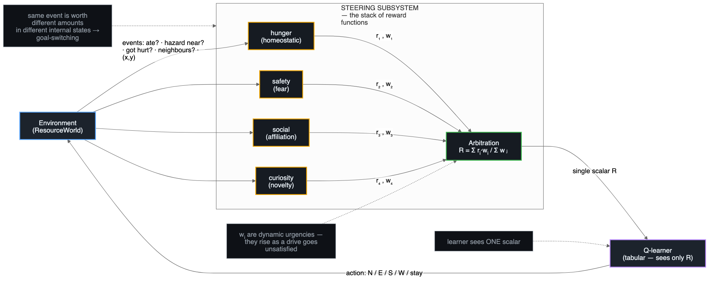

# reward-stack-rl

**Can a *stack of many reward functions* — rather than one monolithic reward —
reproduce the dynamic, self-directing, cooperative behaviour that brains
exhibit?**

This repo is a small, dependency-light (Python + numpy) multi-agent
reinforcement-learning testbed built to probe that question. It grew out of a
design discussion about **Steven Byrnes' (Astera Institute) brain-like-AGI**
picture: the brain as a *Steering Subsystem* (brainstem/hypothalamus — a stack
of innate, hard-wired drives / "reward functions") sitting on top of a *Learning
Subsystem* (the neocortex — a from-scratch learner). Evolution found it cheap to
keep bolting on extra innate drives, and the interaction of that stack — fear
wired to "skittering things", hunger, affiliation, curiosity, all nested under
survival — is a lot of what makes behaviour rich, flexible, and goal-switching.

We test the computational version of that idea: give a tabular RL agent a
**stack of drives** (each a small reward function with its own dynamic urgency)
and a **steering subsystem** that arbitrates between them, then check whether the
resulting behaviour is measurably more dynamic, safer, more social, and more
cooperative than a single-reward baseline — across a progression of
environments.

> Companion docs: **[RESEARCH.md](RESEARCH.md)** (the existing-work landscape —
> Byrnes, Marblestone's cost functions, intrinsic motivation, homeostatic RL,
> cooperative MARL / Melting Pot, Softmax, Era of Experience) and
> **[docs/GAMES.md](docs/GAMES.md)** (survey of available RL environments and a
> build-vs-reuse recommendation). Results write-up: **[RESULTS.md](RESULTS.md)**.

---

## The architecture



*One agent = a stack of N reward functions (drives) + a steering subsystem that
arbitrates them into the single scalar the learner sees. Editable source:
[`docs/architecture.mmd`](docs/architecture.mmd) / [`docs/architecture.excalidraw`](docs/architecture.excalidraw).*

```
            world events                  arbitrated scalar reward
  env  ───────────────────►  ┌─────────────────────────────┐  ───────►  learner
       ("you ate", "hazard   │     Steering Subsystem        │           (tabular
        adjacent", "2 agents │  weighs each drive by its     │            Q-learning)
        nearby", "at cell P")│  *current urgency*            │
                             │  ┌────────┬────────┬───────┐  │
                             │  │ hunger │ safety │ social │  │  ◄─ the STACK
                             │  │(homeo- │ (fear) │(affil- │  │     of drives
                             │  │ static)│        │ iation)│  │
                             │  ├────────┴────────┴───────┤  │
                             │  │       curiosity         │  │
                             │  └─────────────────────────┘  │
                             └─────────────────────────────┘
```

* **Drives** (`rlstack/drives.py`) — each is a reward function with internal
  state. `HomeostaticDrive` (hunger/energy) uses drive-reduction reward
  (Keramati & Gutkin 2014); `SafetyDrive` (fear) punishes hazard proximity;
  `SocialDrive` rewards affiliation/cooperation; `CuriosityDrive` is
  recency-based novelty (a lightweight ICM/RND stand-in); `ReciprocityDrive` is
  an innate fairness term for social dilemmas. Every drive reports a **dynamic
  urgency** so the *same event is worth different amounts in different internal
  states* — the precondition for goal-switching.
* **Steering subsystem** (`rlstack/steering.py`) — collapses the stack into the
  single scalar the learner optimises. Three arbitration modes let us run the
  key contrast: `dynamic` (urgency-weighted), `softmax` (winner-mostly-takes-all),
  and `sum` (fixed-weighted — the "one reward with many terms" control). A
  single-drive subsystem is the monolithic-reward baseline.
* **Agent** (`rlstack/agent.py`) — a `BrainAgent` = a tabular Q-learner + a
  steering subsystem. The environment never hands out a scalar reward; the
  agent's own drives turn world events into reward, so swapping the drive stack
  swaps the entire reward structure with zero environment changes.
* **Evolution** (`rlstack/evolution.py`) — a minimal genetic loop for letting the
  drive-stack parameters **drift across generations**.

## The environments (three tiers)

| Tier | Environment | What it tests |
|------|-------------|----------------|
| 1 — social dilemma | `IteratedPrisonersDilemma` (`envs/prisoners.py`) | cooperation vs defection, trivially evaluable |
| 2 — cooperative control | `TugGame` (`envs/tug.py`) | 3 agents coordinating a **shared actuator** (the "bungee/triangulation" game) |
| 3 — open-ended | `ResourceWorld` (`envs/gridworld.py`) | top-down, procedurally-generated survival world; emergent, dynamic behaviour |

## Quickstart

```bash
pip install numpy             # the only runtime dependency
python -m experiments.run_all # run all 4 experiments + a consolidated scorecard (~100s)
```

Or run them individually:

```bash
python -m experiments.exp_prisoners   # Exp 1: reciprocity flips the dilemma
python -m experiments.exp_gridworld   # Exp 2: drive ablation in ResourceWorld
python -m experiments.exp_tug         # Exp 3: cooperative joint-action control
python -m experiments.exp_evolve      # Exp 4: cooperation evolves across generations
python -m unittest discover -s tests  # 16 unit tests, no pytest needed
```

## Watch it act

Two ways to *see* the agents, not just the numbers:

**Browser dashboard** (`viewer/index.html`) — open it directly in any browser, no
server needed. It animates the trained agents and shows the results charts:
- **ResourceWorld** — watch the agents move; each carries a drive-coloured ring
  showing which drive currently holds the steering wheel, and a live bar panel of
  one agent's drive urgencies. Flip the **Full stack ↔ Survival only** toggle to
  *see* the difference: the stack dodges hazards, clusters, and keeps switching
  goals; the baseline just chases food.
- **TugGame** — toggle **Before ↔ After training** to watch three agents go from
  flailing to gripping the bottle and carrying it to the goal.
- **Results** — the four experiments as charts (cooperation curves, the drive
  ablation, tug delivery, the evolving reciprocity gene).

```bash
python -m viewer.record        # regenerate the replays + results into viewer/data.js
open viewer/index.html         # then just open it (macOS; or double-click the file)
```

**Terminal live viewer** — runs the *real* simulation live in your terminal
(colour ANSI), with a live drive-urgency read-out:

```bash
python -m viewer.live grid             # ResourceWorld, full drive stack
python -m viewer.live grid --survival  # the single-reward baseline, for contrast
python -m viewer.live tug              # cooperative control game
```

## Headline results (one representative seeded run — see [RESULTS.md](RESULTS.md))

1. **Prisoner's dilemma.** An innate `ReciprocityDrive` *stacked on top of
   unchanged game payoffs* lifts cooperation **18% → 50%** and raises realised
   payoff (1.9 → 2.3/move). The payoffs never changed — only the reward stack.
2. **ResourceWorld ablation.** Each drive moves *its own* behaviour the most:
   `+curiosity` → most exploration, `+safety` → hazard exposure **33% → 6%**,
   `+social` → clustering **0.08 → 0.50**, and only the full stack shows
   sustained **goal-switching (0% → 20%)** — the steering signature.
3. **TugGame.** Independent learners coordinating a shared actuator go from
   **21% → 100%** delivery (54 → 4 steps). When task incentives are already
   fully shared, cooperation emerges from the task reward alone — the explicit
   social drive only matters when individual and collective incentives *diverge*
   (the dilemma case).
4. **Generational drift.** Under purely *selfish* payoff selection, the
   reciprocity gene drifts **0.3 → 2.8** and cooperation emerges as a by-product
   (**43% → 77%**) — an Axelrod-style result reproduced from the reward stack.

## How this maps to the original three tasks

This repo was built to deliver the three steps named at the end of the design
discussion:

1. **Find the related work and write it up** → [RESEARCH.md](RESEARCH.md) +
   [docs/GAMES.md](docs/GAMES.md).
2. **Build the environment(s)** → the three-tier suite in `rlstack/envs/`,
   starting simple (IPD) and building up to an open-ended resource world.
3. **Run the loop, test it, present it** → `experiments/` + `tests/` +
   [RESULTS.md](RESULTS.md).

## Caveats & honest limitations

Tabular Q-learning and tiny, discretised worlds were chosen so everything runs
in ~100s on a laptop with no GPU; the point here is the **reward structure**, not
function approximation or scale. Numbers are seed-dependent (seeds are fixed in
the experiment files for reproducibility). The "human-like" claim is
deliberately modest: we show that a dynamically-arbitrated stack produces
*targeted, measurable, qualitatively distinct* behaviour and goal-switching that
a single reward cannot — a necessary precondition for the larger hypothesis, not
proof of it. See [RESULTS.md](RESULTS.md) for the interaction effects and
trade-offs (e.g. a divided-attention survival cost), which are themselves part
of the story.

## Project layout

```
rlstack/
  drives.py        the stack of reward functions
  steering.py      arbitration over the stack (dynamic / softmax / sum)
  agent.py         QLearningAgent + BrainAgent (learner + steering)
  metrics.py       behavioural diversity, goal-switching, cooperation, coverage
  evolution.py     generational drift over drive-stack genomes
  envs/            prisoners.py · tug.py · gridworld.py
experiments/       exp_prisoners · exp_gridworld · exp_tug · exp_evolve · run_all
viewer/            index.html + app.js (browser dashboard) · record.py · live.py (terminal)
tests/             test_core.py (unittest)
results/           committed JSON outputs of the experiments
RESEARCH.md        existing-work landscape review
docs/GAMES.md      survey of available RL environments
RESULTS.md         results write-up
```
